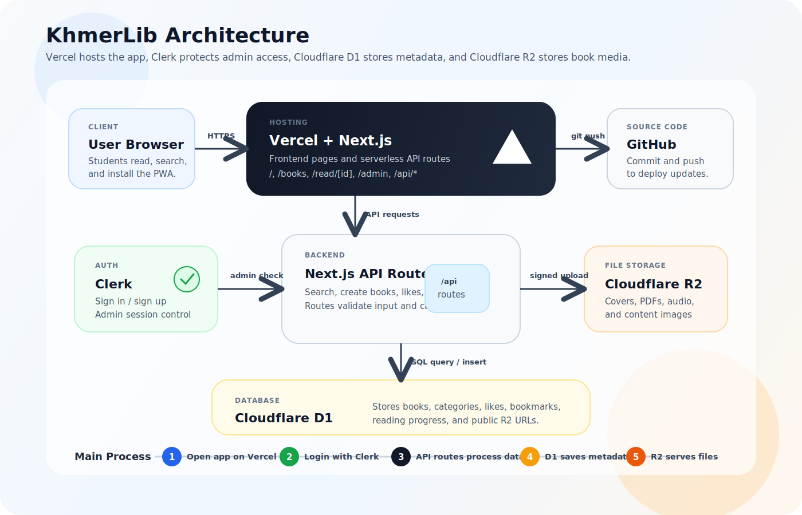

# KhmerLib

KhmerLib is a Khmer digital library for reading, searching, and managing books online. It is built as a full-stack student project with Next.js, Clerk authentication, Cloudflare D1, and Cloudflare R2.

## Architecture



```text
Student/User
  -> Vercel hosts the Next.js frontend and API routes
  -> Clerk handles login and admin authentication
  -> Cloudflare D1 stores book metadata, likes, bookmarks, and progress
  -> Cloudflare R2 stores covers, PDFs, audio, and content images
```

Process:

```text
Search book:
Browser -> /api/search -> Cloudflare D1 -> JSON results -> Book cards

Read book:
Browser -> Next.js page -> D1 metadata -> R2 media files -> Reader

Admin upload:
Admin -> Clerk auth -> /api/admin/uploads/sign -> R2 upload -> D1 record
```

See the full drawing in [docs/ARCHITECTURE.md](docs/ARCHITECTURE.md).

## Documentation

- [Project overview](docs/PROJECT_OVERVIEW.md)
- [Architecture drawing](docs/ARCHITECTURE.md)
- [Student lesson](docs/STUDENT_LESSON.md)
- [Book and media storage guide](docs/BOOK_CONTENT_GUIDE.md)

## Git Setup

```bash
git init
git add .
git commit -m "Initial KhmerLib project"
```

Large local folders such as `all book/`, `file/`, `venv/`, build output, and `.env.local` are ignored by Git.

## Getting Started

Install dependencies and run the development server:

```bash
npm install
npm run dev
```

Open [http://localhost:3000](http://localhost:3000) with your browser.

Create `.env.local` from `.env.example` and fill in Clerk, Cloudflare D1, and Cloudflare R2 values before using admin upload and database features.

## Main Commands

```bash
npm run dev
npm run build
npm run lint
npm run pages:build
npm run pages:deploy
```

## Cloud Resources

- Clerk handles sign-in, sign-up, and admin sessions.
- Cloudflare D1 stores book metadata, likes, bookmarks, and progress.
- Cloudflare R2 stores covers, PDFs, audio, and editor images.

Run `schema.sql` against the D1 database before using the app in production.

## Deploy

```bash
npm run pages:build
npm run pages:deploy
```
